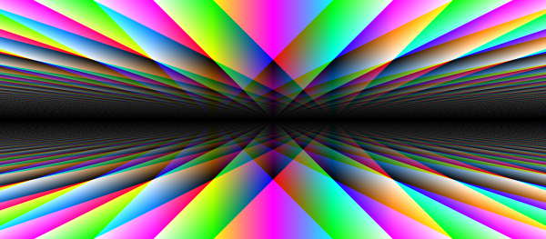

# Eulerdali

  

Create beautiful images using math equations.

## Why?
I wanted to explore the relationship between mathematical formulas and art.

## What?
Eulerdali enables you to input mathematical formulas to visualize them. You can input separate formulas for the Red, Green and Blue color channel. The formulas take the `x` and `y` coordinates as input and output a number.

The sign of the output is ignored. An output of `1` or higher corresponds to maximum brightness. You can use all the functions from the [JavaScript `Math` object](https://developer.mozilla.org/en-US/docs/Web/JavaScript/Reference/Global_Objects/Math).

You can use the `zoom` input for... zooming. The higher the number, the closer you zoom in.

A click on `randomize` creates random formulas. Feel free to try it a bunch of times until you find a cool image.

Eulerdali is open-sourced software licensed under the MIT license.

## How?

Eulerdali is written in TypeScript, without any frameworks. It sets the pixel colors in a HTML canvas using `putImageData`. This is much more efficient than calling `fillRect` a bunch of times.

The random formulas are built recursively by randomly choosing between a bunch of nullary, unary and binary operations.

If you have any questions, feel free to open an issue.

## Who?

Eulerdali was created by [Vincent Rolfs](https://vincentrolfs.github.io).